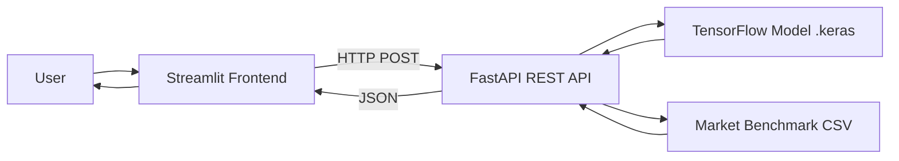

# Cornerstone 💰

> **Auditor Keuangan Personal Berbasis AI** — Coding Camp 2026 powered by DBS Foundation
> **Tim:** CC26-PRU462

Cornerstone bukan sekadar pencatat transaksi, tapi **mengaudit** apakah pengeluaranmu efisien. Sistem mengklasifikasikan transaksi secara otomatis menggunakan Deep Learning, lalu membandingkannya dengan benchmark harga pasar untuk mendeteksi *spending leakage* (pembelian overpriced).

## 🔗 Demo

- **Dashboard (live):** https://cornerstone-8wvwszs2egddb8vwckasc5.streamlit.app
- **REST API (live):** https://noname3214-cornerstone-api.hf.space/docs

## ✨ Fitur

1. **Klasifikasi Transaksi Otomatis** — model Deep Learning (TensorFlow Functional API) mengkategorikan transaksi dari deskripsi teks ke 5 kategori: Bills, Entertainment, Food & Beverage, Shopping, Transport.
2. **Financial Health Meter** — skor 0–100 berdasarkan rasio pengeluaran terhadap pemasukan.
3. **Spending Leakage Detection** — peringatan ketika pembelian di atas rentang harga wajar kategori.
4. **Predictive Insight** — proyeksi sisa saldo di akhir bulan berdasarkan pola pengeluaran.

## 🏗️ Arsitektur



Arsitektur **decoupled**: frontend (Streamlit) memanggil REST API (FastAPI) via HTTP. API melayani inferensi model dan logika bisnis. Frontend tidak memuat model secara langsung.

## 🛠️ Tech Stack

| Komponen | Teknologi |
|---|---|
| Model AI | TensorFlow (Functional API, multi-input: teks + amount) |
| REST API | FastAPI + Uvicorn |
| Frontend | Streamlit + Plotly |
| Data | Pandas, NumPy, scikit-learn |
| Deployment | Streamlit Cloud (frontend), Hugging Face Spaces / Docker (API) |

## 📁 Struktur Repository

```
cornerstone/
├── streamlit_app.py              # Frontend dashboard (thin client → API)
├── cornerstone_preprocessing.py  # Modul text cleaning (wajib match training)
├── cornerstone_model.keras       # Model terlatih (94.68% akurasi)
├── benchmark_clean_final.csv     # Market benchmark untuk leakage detection
└── requirements.txt
```

> Catatan: kode REST API (`api.py`, `Dockerfile`) di-deploy di Hugging Face Spaces. Lihat link Demo di atas.

## 🚀 Cara Menjalankan Lokal

### Frontend (Streamlit)
```bash
git clone https://github.com/Muhammad-Daffa-Ariq-Fadilah/cornerstone.git
cd cornerstone
pip install -r requirements.txt
streamlit run streamlit_app.py
```
Buka `http://localhost:8501`. Set **API URL** di sidebar ke endpoint API (default sudah mengarah ke HF Space).

### REST API (opsional, jalankan sendiri)
File API ada di Hugging Face Space. Untuk menjalankan lokal:
```bash
pip install fastapi "uvicorn[standard]" tensorflow-cpu pandas numpy pydantic
uvicorn api:app --reload
```
Buka `http://127.0.0.1:8000/docs` untuk Swagger UI.

## 🔁 Cara Replikasi

1. **Dataset** — gunakan dataset transaksi (kolom `transaction_name`, `amount`, `category`) dan market benchmark hasil riset tim Data Scientist.
2. **Preprocessing** — `cornerstone_preprocessing.py` membersihkan teks (leet normalization, lowercase, merchant normalization). **Penting:** inferensi WAJIB memakai cleaning yang sama dengan training, atau akurasi turun signifikan.
3. **Training model** — TensorFlow Functional API, multi-input (teks + amount), Custom Callback untuk monitoring, ekspor ke `.keras`.
4. **Serving** — model dilayani via FastAPI (`/predict`, `/leakage`, `/health-score`, `/analyze`).
5. **Frontend** — Streamlit memanggil API dan menampilkan dashboard.

## 📡 API Endpoints

| Method | Endpoint | Fungsi |
|---|---|---|
| GET | `/` | Status service |
| GET | `/health` | Healthcheck |
| POST | `/predict` | Klasifikasi 1 transaksi |
| POST | `/leakage` | Klasifikasi + deteksi spending leakage |
| POST | `/health-score` | Financial Health Score |
| POST | `/analyze` | Full audit (semua transaksi + health score) |

Contoh:
```bash
curl -X POST https://noname3214-cornerstone-api.hf.space/predict \
  -H "Content-Type: application/json" \
  -d '{"description": "bayar listrik pln", "amount": 350000}'
```

## ⚠️ Limitasi

- Model sensitif terhadap nominal pada transaksi berdeskripsi ambigu (nominal kecil cenderung diklasifikasikan sebagai Food & Beverage).
- Bias pada brand multi-layanan: gojek/grab muncul di konteks makanan & transport pada data training, sehingga model cenderung mengklasifikasikannya sebagai Food & Beverage.
- Deteksi leakage berbasis rata-rata kategori, belum item-level.
- Free tier hosting dapat mengalami cold-start (~30–60 detik) setelah idle.

**Future work:** rebalance bobot fitur amount, augmentasi data untuk disambiguasi brand multi-layanan, deteksi leakage berbasis item-matching.

## 👥 Tim CC26-PRU462

| Nama | Role |
|---|---|
| Muhammad Daffa Ariq Fadilah | AI Engineer |
| Ajie Iskandar Zulkarnain | AI Engineer |
| Devan Haidar Wirya Hidayat | Data Scientist |
| Sebastian Wibowo | Data Scientist |
| Innayatul Laili Husnaini | Data Scientist |

## 📄 Lisensi

Educational project — Coding Camp 2026 powered by DBS Foundation.
