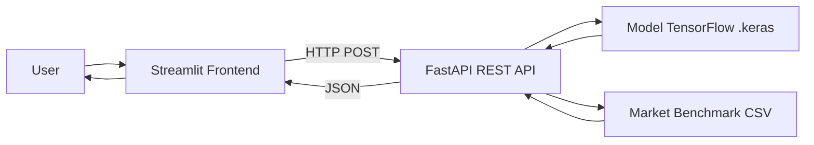

# Cornerstone 💰

> **Auditor Keuangan Personal Berbasis AI** - Coding Camp 2026 powered by DBS Foundation
> **Tim:** CC26-PRU462

Cornerstone bukan sekadar pencatat transaksi, tapi **mengaudit** apakah pengeluaranmu efisien. Sistem mengklasifikasikan transaksi secara otomatis menggunakan Deep Learning, lalu membandingkannya dengan benchmark harga pasar untuk mendeteksi *spending leakage* (pembelian yang harganya tidak wajar).

## 🔗 Demo

- **Dashboard (live):** https://cornerstone-8wvwszs2egddb8vwckasc.streamlit.app
- **REST API (live):** https://noname3214-cornerstone-api.hf.space/docs

## 📦 Akses Model

Model AI (`cornerstone_model_v2.keras`) tersedia di:
- Repository ini (folder `model/`), dan
- **Google Drive:** https://drive.google.com/drive/u/0/folders/1vPCnc-uW6sAQrTrKBi-xki7A8osmp4w5 - sudah diberi akses untuk `capstone@student.devacademy.id`

## ✨ Fitur

1. **Klasifikasi Transaksi Otomatis** - model Deep Learning mengkategorikan transaksi pengeluaran ke 5 kategori: Tagihan, Hiburan, Makanan & Minuman, Belanja, Transportasi.
2. **Tipe Transaksi** - Pengeluaran (diklasifikasi AI), Pemasukan, dan Transfer (dicatat manual) dipisahkan agar AI hanya menilai pengeluaran.
3. **Financial Health Meter** - skor 0–100 berdasarkan rasio pengeluaran terhadap pemasukan.
4. **Spending Leakage Detection** - peringatan ketika pembelian melebihi rentang harga wajar kategori.
5. **Frekuensi Langganan** - transaksi Mingguan/Bulanan/Tahunan dinormalisasi ke per-bulan agar leakage adil (mis. langganan tahunan tidak salah dianggap boros).
6. **Predictive Insight** - proyeksi sisa saldo akhir bulan.
7. **Upload CSV** - input transaksi massal sekaligus.

## 🏗️ Arsitektur



Arsitektur **decoupled**: frontend (Streamlit) memanggil REST API (FastAPI) via HTTP. API melayani inferensi model dan logika bisnis; frontend tidak memuat model langsung.

## 🛠️ Tech Stack

| Komponen | Teknologi |
|---|---|
| Model AI | TensorFlow (multi-input: teks + amount) |
| Preprocessing | Tokenizer + pad_sequences (maxlen 20), RobustScaler |
| REST API | FastAPI + Uvicorn |
| Frontend | Streamlit + Plotly |
| Data | Pandas, NumPy |
| Deployment | Streamlit Cloud (frontend), Hugging Face Spaces / Docker (API) |

## 📁 Struktur Repository

```
cornerstone/
├── frontend/
│   ├── streamlit_app.py          # Dashboard (thin client → API)
│   └── requirements.txt
├── api/
│   ├── api.py                    # REST API (FastAPI)
│   ├── tokenizer.pkl             # Tokenizer Keras
│   ├── market_benchmark_cleaned.csv
│   ├── cornerstone_model_v2.keras   # model (untuk menjalankan/deploy API)
│   ├── requirements.txt
│   ├── Dockerfile
│   └── README.md                 # frontmatter untuk deploy ke Hugging Face
├── model/
│   └── cornerstone_model_v2.keras   # Model terlatih (akurasi 99.84%) — juga di-upload ke Google Drive
├── notebook/
│   └── training.ipynb            # Notebook training model
└── README.md
```

> Catatan: REST API juga di-deploy di Hugging Face Spaces (lihat link Demo). Kode API di folder `api/` adalah sumber yang sama.

## 🚀 Cara Instalasi & Menjalankan

### 1. Frontend (Streamlit)
```bash
git clone https://github.com/Muhammad-Daffa-Ariq-Fadilah/cornerstone.git
cd cornerstone/frontend
pip install -r requirements.txt
streamlit run streamlit_app.py
```
Buka `http://localhost:8501`. Atur **API URL** di sidebar ke endpoint API.

### 2. REST API (FastAPI)
```bash
cd cornerstone/api
pip install -r requirements.txt
uvicorn api:app --reload
```
Buka `http://127.0.0.1:8000/docs` untuk Swagger UI. Model `cornerstone_model_v2.keras` sudah tersedia di folder `api/`.

## 📖 Petunjuk Penggunaan

1. Isi **Pemasukan bulanan** di sidebar.
2. Catat transaksi:
   - **Pengeluaran** → otomatis diklasifikasi AI + dicek leakage. Pilih frekuensi (Sekali/Mingguan/Bulanan/Tahunan).
   - **Pemasukan** → pilih kategori (Gaji/Bonus/dll).
   - **Transfer** → dicatat terpisah (tidak dihitung konsumsi).
3. Atau gunakan **Upload CSV** (kolom `description`, `amount`, opsional `period`).
4. Lihat dashboard: Health Meter, distribusi kategori, Spending Leakage, proyeksi akhir bulan.
5. Riwayat transaksi dapat difilter, di-scroll, diunduh (CSV), dan dihapus per item.

## 🔁 Replikasi Pipeline

1. **Dataset** — transaksi (`transaction_name`, `amount`, `category`) + market benchmark hasil riset tim Data Scientist.
2. **Preprocessing** — teks → tokenizer → pad_sequences (maxlen 20); amount → RobustScaler.
3. **Training** — TensorFlow (multi-input teks + amount), Custom Callback, ekspor `.keras`.
4. **Serving** — model dilayani via FastAPI (`/predict`, `/leakage`, `/health-score`, `/analyze`).
5. **Frontend** — Streamlit memanggil API & menampilkan dashboard.

## 📡 API Endpoints

| Method | Endpoint | Fungsi |
|---|---|---|
| GET | `/` | Status service |
| GET | `/health` | Healthcheck |
| POST | `/predict` | Klasifikasi 1 transaksi |
| POST | `/leakage` | Klasifikasi + deteksi spending leakage |
| POST | `/health-score` | Financial Health Score |
| POST | `/analyze` | Full audit (semua transaksi + health score) |

## ⚠️ Limitasi & Pengembangan Lanjutan

- Deteksi leakage berbasis rentang harga per kategori, belum item-level.
- Hosting free tier dapat mengalami cold-start (~30–60 detik) setelah idle.
- Benchmark harga perlu diperbarui berkala mengikuti inflasi/harga pasar.

**Future work:** deteksi leakage berbasis item-matching, integrasi data e-wallet, personalisasi per profil pengguna.

## 👥 Tim CC26-PRU462

| Nama | Role |
|---|---|
| Muhammad Daffa Ariq Fadilah | AI Engineer |
| Ajie Iskandar Zulkarnain | AI Engineer |
| Devan Haidar Wirya Hidayat | Data Scientist |
| Sebastian Wibowo | Data Scientist |
| Innayatul Laili Husnaini | Data Scientist |

## 📄 Lisensi

Educational project — Coding Camp 2026 powered by DBS Foundation.
